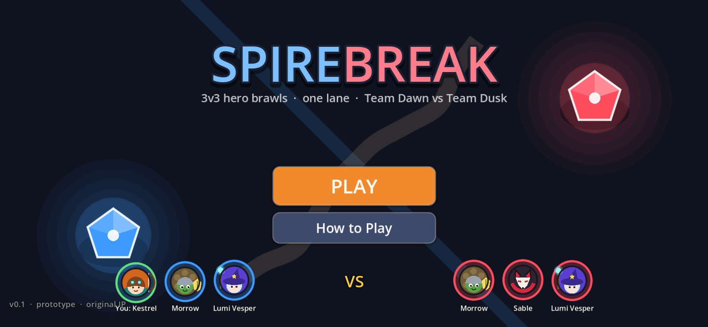
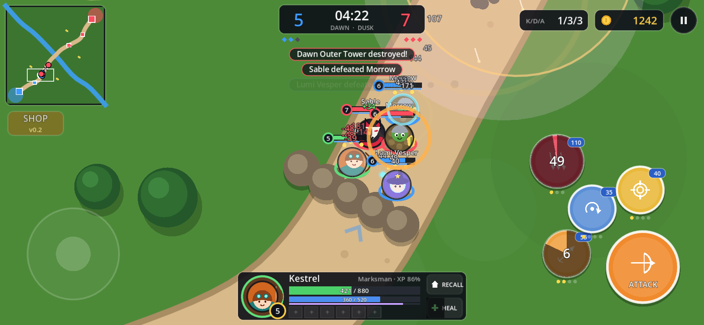
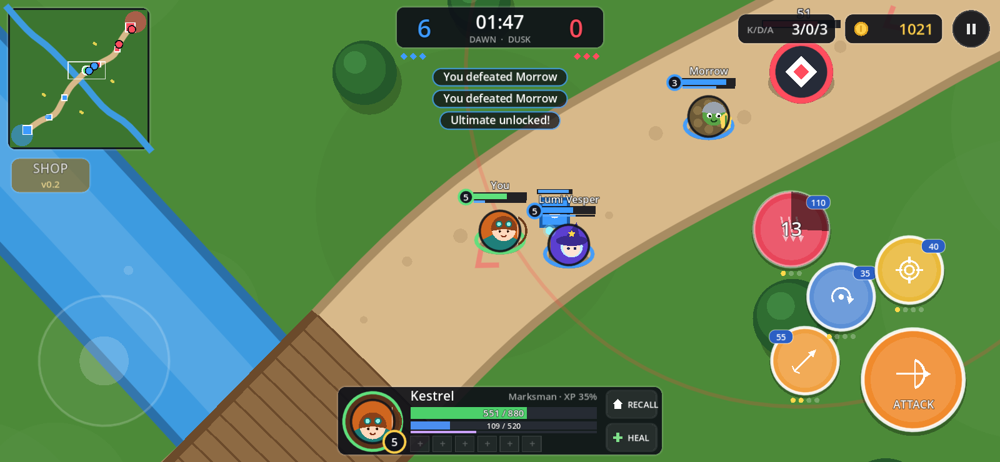
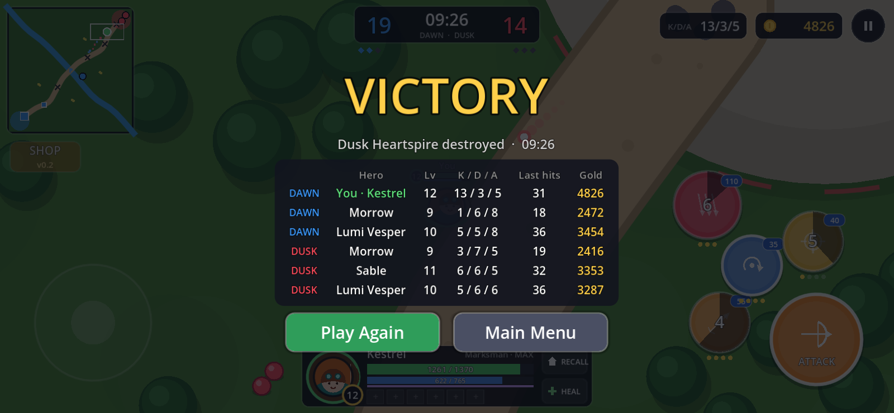

# Spirebreak (v0.1)

An original **3v3 one-lane mobile MOBA** prototype made with **Godot 4.5.1** (GL Compatibility).
You play **Kestrel** (marksman) with two bot allies, **Morrow** and **Lumi Vesper**, against a bot team of
**Morrow, Sable and Lumi Vesper**. Destroy the two enemy towers, then the **Heartspire**, to win.
Matches usually last 8–12 minutes.

## ▶ Play now

**https://tomokifaizuru.github.io/spirebreak-moba/**

The game runs in landscape. On a phone, rotate it sideways. The web build is single-threaded, so it
needs no special server headers.






## Controls

| Action | Touch | Keyboard / mouse |
|---|---|---|
| Move | Virtual joystick (left side of the screen) | WASD / arrow keys, or right-click to walk there |
| Basic attack | Hold **ATTACK** (attacks the closest target) | Space / J (hold) |
| Skills 1–3 | Tap to auto-aim, drag to aim, drag back to the center to cancel | 1 2 3 or Q E F (aims at the mouse) |
| Ultimate (unlocks at level 4) | Big red button | 4 / R |
| Recall to base (4 s channel) | RECALL | B |
| Heal spell | HEAL | H |
| Look around | Drag on the minimap | — |
| Pause | ‖ button | Esc / P |
| (mouse) | — | Left-click works like a finger on the on-screen buttons and joystick |
| Autopilot (debug) | — | F8 (or add `#autopilot&speed=4` to the URL) |

Skills level up automatically: the ultimate at levels 4, 8 and 12, the others in each hero's priority order.

## Open in Godot

1. Install **Godot 4.5.1 stable** (standard build, not .NET).
2. Open the Project Manager, click **Import**, select this folder's `project.godot`, then **Import & Edit**.
3. Press **F5** to play. The main scene is `scenes/title.tscn`.
4. To build for the web, use **Project → Export… → Web**. The output is `docs/index.html`, with threads off.

**Renaming the game:** change **Project Settings → Application → Config → Name** (`config/name` in
`project.godot`). The title screen and the window title read it from there.

## Tweak the game (no code needed)

Open any of these in the Inspector. The fields are commented, so hover them for tooltips.

| File | What it controls |
|---|---|
| `data/match_config.tres` | Team lineups, creep waves (timing, counts, siege interval, empowered creeps), gold, XP and level curve, respawn timers, fountain, healing shrine, recall, heal spell, tower aggro/ramp, backdoor protection, sudden death, 15:00 tiebreak, bot difficulty |
| `data/heroes/*.tres` | Kestrel, Morrow, Lumi, Sable: HP/mana and growth, damage, attack speed and range, armor, move speed, colors, skill order, bot retreat HP and aggression |
| `data/abilities/*.tres` | All 16 skills: cooldown, mana, damage, range, radius, duration, effect values (per rank) |
| `data/units/*.tres` | Creeps (melee, ranged, siege), jungle monster, Outer and Inner Tower, Heartspire: HP, armor, damage, range, bounty, growth per minute |
| `scenes/maps/one_lane.tscn` | The map. Move the Marker2D nodes (Lane, River, Camps, Shrine, Fountains, Structures) and the art redraws live in the editor |

Other knobs are `@export` variables on the scripts in `scripts/` (camera zoom, HUD sizes, bot reaction times).
`tools/make_data.gd` regenerates the default `.tres` files. Running it overwrites any edits you made in the Inspector.

## Headless test tools

```
# Bot-vs-bot match (your hero on autopilot), prints a timeline and the result:
godot --headless --path . --fixed-fps 60 -s tools/sim_match.gd -- seed=1 limit=1100
# Screenshots (needs a display, e.g. xvfb-run):
godot --path . --resolution 1600x740 -s tools/shots.gd -- shot=teamfight out=/tmp/a.png
```

## What's in v0.1 / planned

- In v0.1: one lane with a river, bridge, 2 towers + Heartspire per side, jungle camps, fountains, a river shrine,
  creep waves (melee/ranged/siege) with proper aggro, tower aggro rules, buildings that fall in order,
  4 heroes with 3 skills + ultimate each, XP to level 12, gold, kill streaks, respawn, recall, bots, minimap, kill feed,
  a win/lose screen, and simple synthesized SFX. All art is drawn in code.
- Planned for v0.2: an item shop (the button is a placeholder), the Golem boss, manual skill leveling, more heroes,
  and bots that farm jungle camps.

All characters, names and art are original.
