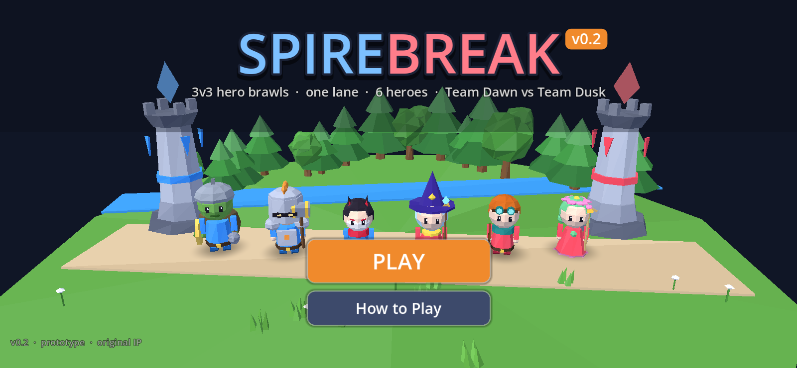
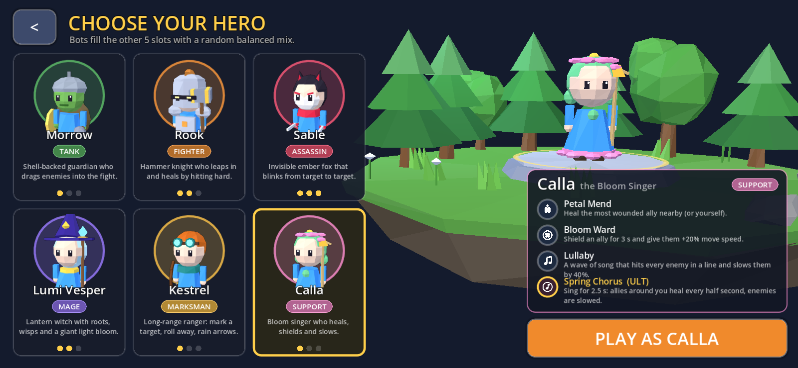
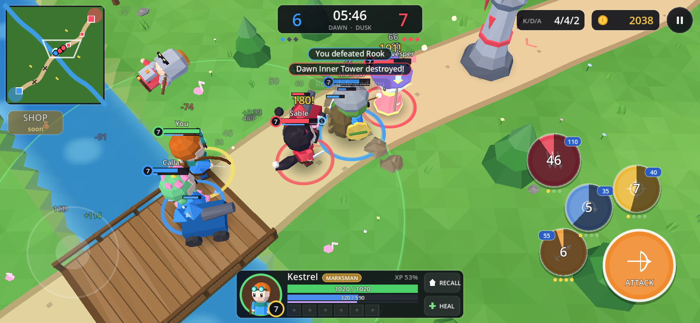
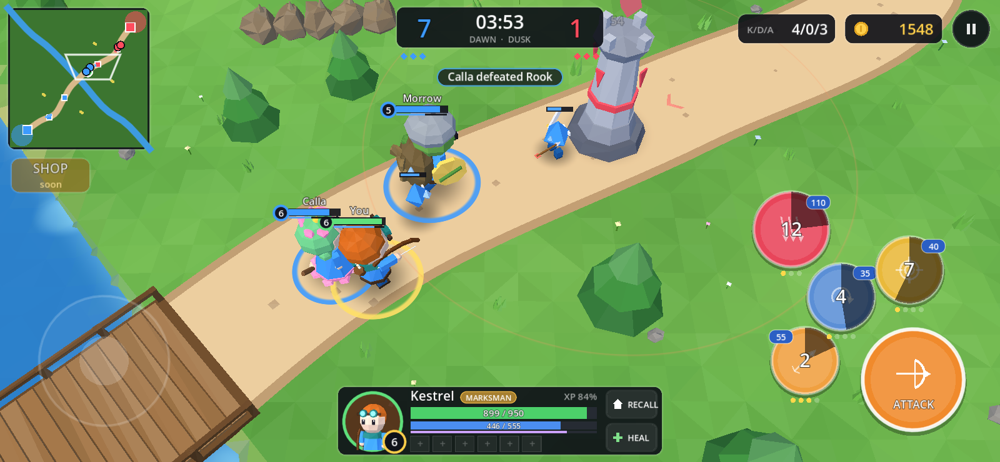

# Spirebreak (v0.2)

An original **3v3 one-lane mobile MOBA** prototype made with **Godot 4.5.1** (GL Compatibility).
v0.2 moves the game to **low-poly chibi 3D** and adds a **hero select** screen with **6 heroes** and their roles.
Pick a hero; bots fill the other 5 slots with a random, sensible mix. Destroy the two enemy towers, then
the **Heartspire**, to win. Matches usually last 7–12 minutes.

## ▶ Play now

**https://tomokifaizuru.github.io/spirebreak-moba/**

The game runs in landscape. On a phone, rotate it sideways. The web build is single-threaded, so it
needs no special server headers.






## Roster

| Hero | Role | Difficulty | Plays like | Skills (3 + ultimate) |
|---|---|---|---|---|
| **Morrow**, the Mossback Warden | 🟩 Tank | ●○○ | Shell-backed guardian who drags enemies into the fight | Shell Bash (stun dash) · Barkskin (shield) · Rootcall Roar (taunt) · **Landslide** (charge + rock wall) |
| **Rook**, the Hammer Knight *(new)* | 🟧 Fighter | ●●○ | Leaps in and heals by hitting hard | Quake Swing (wide swing, heals 25% of damage) · Iron Leap (leap, damage + slow on landing) · Battle Hunger (+35% attack speed, lifesteal) · **Anvil Fall** (huge leap slam, 1 s stun, shield per hero hit) |
| **Sable**, the Ember Fox | 🟥 Assassin | ●●● | Invisible fox that blinks from target to target | Ember Dash (resets on kill) · Twin Fang (2 slashes, heals) · Smoke Veil (invisible + fast) · **Hundred Petals** (untargetable blink strikes) |
| **Lumi Vesper**, the Lantern Witch | 🟪 Mage | ●●○ | Roots, wisps and a giant light bloom | Wisp Bolt (homing burst) · Star Snare (delayed root) · Lantern Hop (blink + slow glow) · **Night Bloom** (big delayed explosion) |
| **Kestrel**, the Dune Ranger | 🟨 Marksman | ●○○ | Long-range ranger: mark, roll away, rain arrows | Piercing Bolt (line shot) · Tumble (roll, empowered shot) · Hawk Mark (reveal, +15% damage taken) · **Sky Volley** (arrow rain, slow) |
| **Calla**, the Bloom Singer *(new)* | 🩷 Support | ●○○ | Heals, shields and slows | Petal Mend (heal the most hurt ally) · Bloom Ward (shield + 20% speed on an ally) · Lullaby (line wave, 40% slow) · **Spring Chorus** (2.5 s song: allies heal every 0.5 s, enemies slowed) |

Your role is shown on the hero cards, in the HUD portrait, in the kill feed line at match start and on the
end-of-match scoreboard. Every hero appears once per match: the other five are split into 2 allies and 3 enemies,
and the split is scored so each side gets a frontliner (Tank or Fighter) and ranged damage, with a random pick among
the best splits. Bot Calla heals and shields hurt allies, and bot Rook leaps in to engage.

## Controls

| Action | Touch | Keyboard / mouse |
|---|---|---|
| Move | Virtual joystick (left side of the screen) | WASD / arrow keys, or right-click to walk there |
| Basic attack | Hold **ATTACK** (attacks the closest target) | Space / J (hold) |
| Skills 1–3 | Tap to auto-aim, drag to aim, drag back to the center to cancel | 1 2 3 or Q E F (aims at the mouse) |
| Ultimate (unlocks at level 4) | Big red button | 4 / R |
| Recall to base (4 s channel) | RECALL | B |
| Heal spell | HEAL | H |
| Look around | Drag on the minimap | — |
| Pause | ‖ button | Esc / P |
| Autopilot (debug) | — | F8 (or add `#autopilot&speed=4` to the URL) |

Ally-targeted skills (Petal Mend, Bloom Ward) pick the most wounded ally in range automatically.
Skills level up automatically: the ultimate at levels 4, 8 and 12, the others in each hero's priority order.

## Open in Godot

1. Install **Godot 4.5.1 stable** (standard build, not .NET).
2. Open the Project Manager, click **Import**, select this folder's `project.godot`, then **Import & Edit**.
3. Press **F5** to play. The main scene is `scenes/title.tscn` (Title → Hero Select → Match).
4. To build for the web, use **Project → Export… → Web**. The output is `docs/index.html`, with threads off.

**Renaming the game:** change **Project Settings → Application → Config → Name** (`config/name` in
`project.godot`). The title screen and the window title read it from there. The version badge reads `config/version`.

## How the 3D works

- The match simulation is unchanged 2D logic (units are `Node2D`s in pixel coordinates), so bot-vs-bot
  sims still run headless. `scripts/view3d/world_view.gd` mirrors it every frame in 3D (1 m = 100 px).
- Everything is built procedurally from primitives at startup: no imported models or textures.
  - `terrain.gd`: faceted ground with a carved river, lane ribbon, bridge, base platforms, fountains,
    shrine island, jungle clearings and trees/rocks/flowers as chunked MultiMeshes.
  - `model_lib.gd`: towers, Heartspire, crystal creeps, the jungle Thornling and projectiles.
  - `hero_model.gd`: the chibi heroes (team colour outfit plus each hero's own colours) with procedural idle,
    walk, attack, cast, leap and death animations.
  - `unit_visuals.gd` / `fx_visuals.gd`: per-unit visuals, skill areas, projectiles, rings and particle bursts.
  - `world_overlay.gd` (in `scripts/ui/`): health bars, names and floating numbers over the 3D view.
- Phone-friendly choices: about 110 draw calls and 35k triangles in a busy frame, flat vertex colours with a
  single shared material, per-vertex lighting, no real-time shadows (blob shadows instead), MultiMesh foliage
  and an unshaded water shader.

## Tweak the game (no code needed)

Open any of these in the Inspector. The fields are commented, so hover them for tooltips.

| File | What it controls |
|---|---|
| `data/match_config.tres` | The hero roster, default lineups, creep waves, gold, XP and level curve, respawn timers, fountain, shrine, recall, heal spell, tower aggro/ramp, backdoor protection, sudden death, tiebreak, bot difficulty |
| `data/heroes/*.tres` | All 6 heroes: role, tagline, difficulty, HP/mana and growth, damage, attack speed and range, armor, move speed, colours (body / accent / detail), model scale, skill order, bot retreat HP and aggression |
| `data/abilities/*.tres` | All 24 skills: aim type, cooldown, mana, damage, range, radius, duration, effect values (per rank) |
| `data/units/*.tres` | Creeps, jungle monster, towers, Heartspire: HP, armor, damage, range, bounty, growth per minute |
| `scenes/maps/one_lane.tscn` | The map. Move the Marker2D nodes (Lane, River, Camps, Shrine, Fountains, Structures); the 3D world is built from them |
| `scenes/match.tscn` → `Match` node | Camera pitch, distance and field of view |

Other knobs are constants and `@export`s in `scripts/view3d/` (unit display scale, colours, ground grid size).
`tools/make_data.gd` regenerates the default `.tres` files. Running it overwrites any edits you made in the Inspector.

## Headless test tools

```
# Bot-vs-bot match with a random hero and random bot teams (or hero=calla etc.):
godot --headless --path . --fixed-fps 60 -s tools/sim_match.gd -- seed=1 limit=1100 hero=random
# Screenshots (needs a display, e.g. xvfb-run):
godot --path . --resolution 1600x740 -s tools/shots.gd -- shot=heroselect pick=calla out=/tmp/a.png
#   shot = title | heroselect | teamfight | tower | early | victory
```

## Versions

- **v0.2**: full 3D low-poly look (angled follow camera, 3D terrain/river/bridge/forest, chibi heroes,
  crystal creeps, towers with floating crystals, 3D skill effects and particles); hero select with 6 heroes and
  roles; new heroes Calla (Support) and Rook (Fighter); randomized balanced bot teams; role shown in the HUD;
  bot support/fighter AI; balance pass.
- **v0.1**: one lane with river and bridge, towers and Heartspire, jungle camps, fountains, shrine, creep waves,
  4 heroes, XP/gold/levels, bots, minimap, kill feed, win/lose screen, synthesized SFX.
- Planned: an item shop (the button is a placeholder), a jungle boss, manual skill leveling, more heroes.

All characters, names, models and art are original and made in code.
