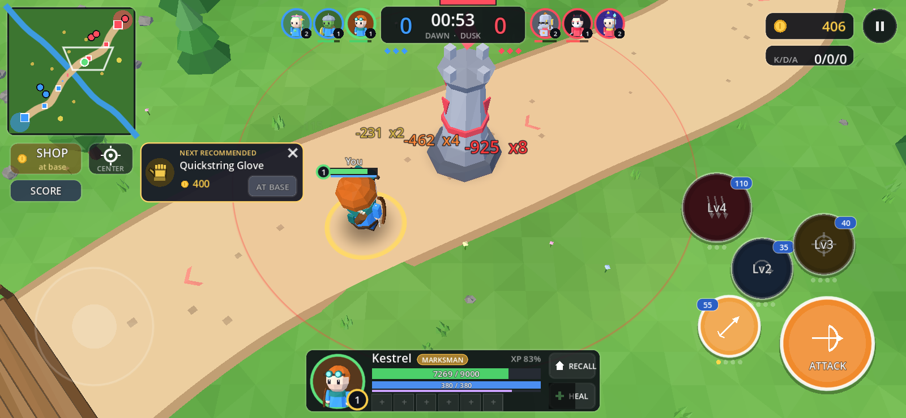
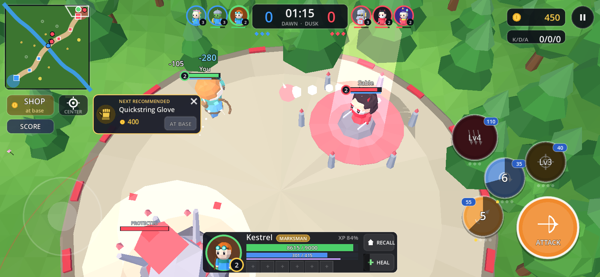
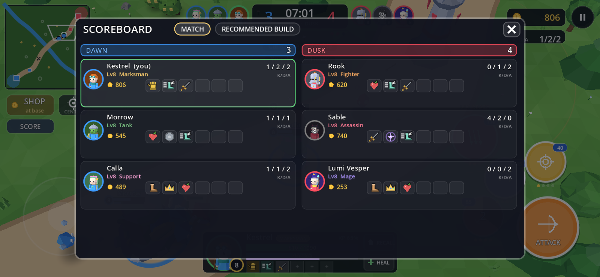
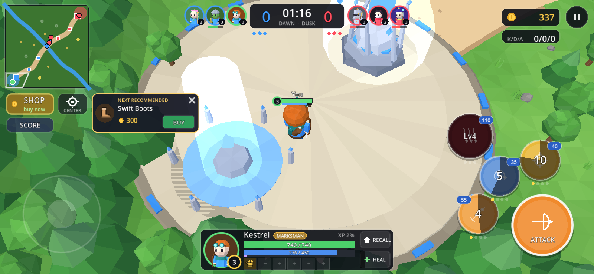
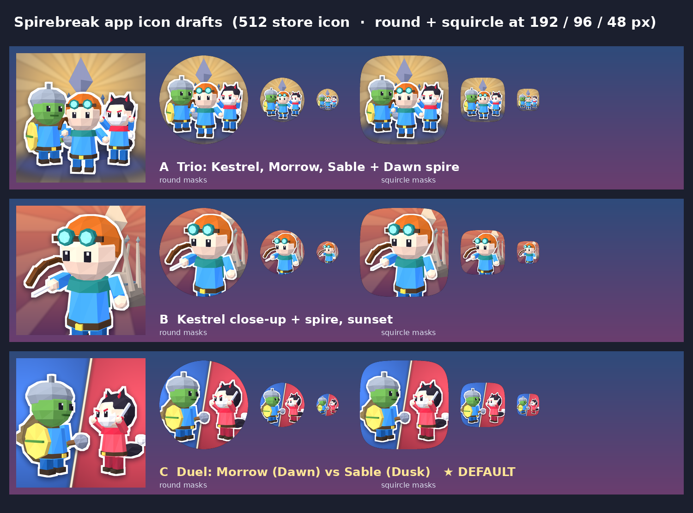
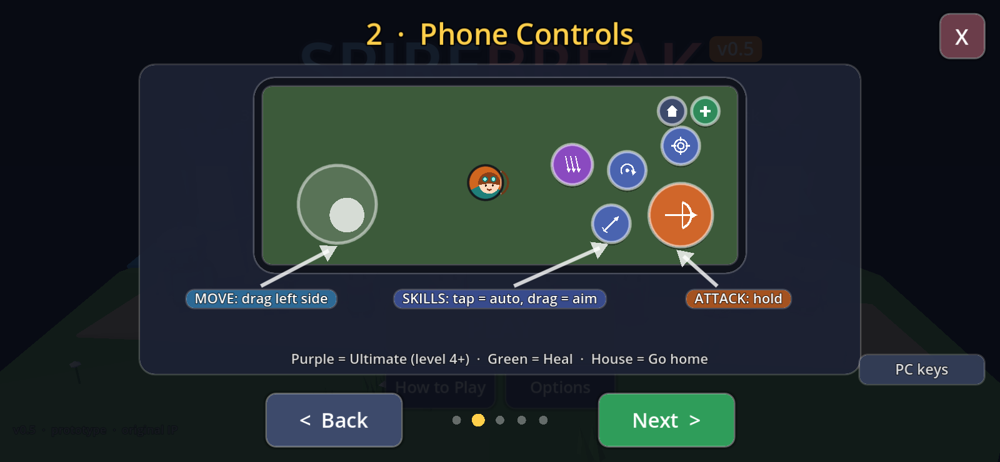
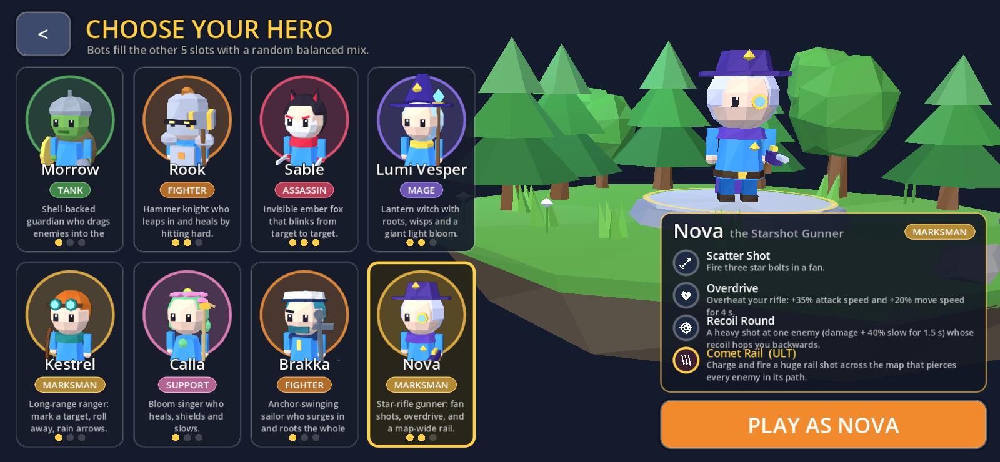
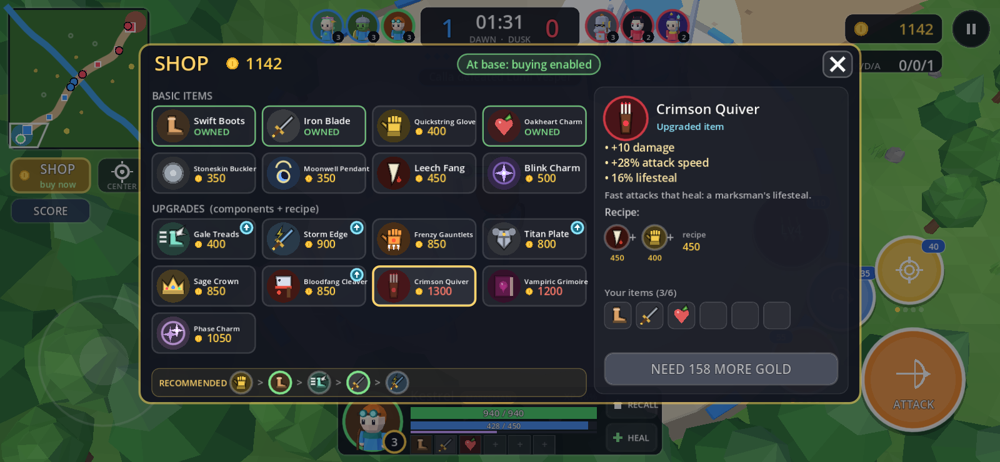

# Spirebreak (v0.6)

An original **3v3 one-lane mobile MOBA** prototype made with **Godot 4.5.1** (GL Compatibility).
Low-poly chibi 3D, 6 heroes with roles, a shop with combining items, a scoreboard, recommended builds and
10 jungle camps. New in v0.5: **ramping tower shots**, **fountains that shoot divers**, **jungle gold that
grows over time**, and attack-speed growth for Kestrel.
Pick a hero; bots fill the other 5 slots with a random, sensible mix. Destroy the two enemy towers,
then the **Heartspire**, to win. Matches usually last 7–12 minutes.

## ▶ Play now

**https://tomokifaizuru.github.io/spirebreak-moba/**

The game runs in landscape. On a phone, rotate it sideways. The web build is single-threaded, so it
needs no special server headers.






## 📱 Install on Android

**Download:** https://github.com/tomokifaizuru/spirebreak-moba/releases/download/v0.6-android/Spirebreak-v0.6.apk
(release page: https://github.com/tomokifaizuru/spirebreak-moba/releases/tag/v0.6-android)

1. Open the link on your phone and download `Spirebreak-v0.6.apk` (about 52 MB).
2. Tap the downloaded file. If Android blocks it, allow your browser or Files app under
   **Settings → Apps → Special app access → Install unknown apps**, then tap the file again.
3. Google Play Protect may warn that the app is from an unknown developer. Choose **More details → Install anyway**.
   The app asks for no permissions.
4. Launch **Spirebreak** from the home screen. It runs fullscreen (immersive) in landscape and follows
   the phone's rotation between the two landscape sides.

- Needs Android 7.0+ (API 24) with OpenGL ES 3.0 and an ARM CPU (arm64-v8a or armeabi-v7a), which covers nearly all phones.
- Settings (Music / SFX volume) are saved on the device. The match music loops natively.
- **Updating:** a newer APK installs over this one only if it is signed with the same key. If you see
  "App not installed" / a signature conflict, uninstall the old version first.
- **Building the APK yourself:** Godot 4.5.1 with the Android export templates, JDK 17 and the Android
  SDK (platform-tools, build-tools 35.0.0, platform 35) set in Editor Settings → Export → Android. Then
  **Project → Export… → Android**. The preset uses the prebuilt template (no Gradle), the GL Compatibility
  renderer, arm64-v8a + armeabi-v7a, package `com.tomokifaizuru.spirebreak` and version 0.5 (code 5).
  The release keystore is **not** in this repo. Supply your own through the preset or the
  `GODOT_ANDROID_KEYSTORE_RELEASE_*` environment variables.
- **App icon:** the Dawn vs Dusk duel (Morrow vs Sable, rendered from the in-game models), in
  `assets/icon/` (main + adaptive foreground/background/monochrome). Other drafts are in
  `icon-drafts/` (see `icon-drafts/icons-sheet.png`). They are rebuilt by `tools/make_icons.gd` +
  `tools/compose_icons.py`.



## What's new in v0.6





- **Picture-book How to Play**: 5 swipeable cards (Goal, Phone Controls, Watch Out!, Gold & Levels, Shop)
  with drawings, short captions and big Back / Next buttons, plus an optional PC-keys card.
- **New heroes** (8 total, 4-column hero select):
  - **Brakka, the Tide Brawler** (Fighter, melee): Tidal Cleave (sweep, heals 25% of damage), Undertow Rush
    (dash through enemies, slow), Brine Guard (15% max-HP shield + 20% haste), ult **Maelstrom Slam**
    (wind-up whirlpool around you: damage + 1.3/1.5/1.7 s root).
  - **Nova, the Starshot Gunner** (Marksman, ranged): Scatter Shot (3-bolt fan), Overdrive (+35% attack speed,
    +20% move speed, 4 s), Recoil Round (target shot + 40% slow, recoil hops you back), ult **Comet Rail**
    (13 m piercing rail shot).
- **Kestrel**: +3.5% attack damage per level (on top of +3.5% attack speed per level) and +15% damage to
  creeps and jungle monsters from level 6.
- **Lifesteal items**: new **Crimson Quiver** (Leech Fang + Quickstring Glove + 450: +10 dmg, +28% AS,
  16% lifesteal) and **Vampiric Grimoire** (Leech Fang + Moonwell Pendant + 400: +200 mana, +2 mana regen,
  -8% cooldowns, 8% lifesteal, **18% spell vamp** = skills heal you). Existing: Leech Fang (12%),
  Bloodfang Cleaver (20%).
- Bot lineups now pick 2 allies + 3 enemies from the full 8-hero pool.

## What's new in v0.5

- **Tower damage ramp vs heroes**: each tower shot in a row at the *same* hero does double the last one
  (1×, 2×, 4×, 8×), capped at **8×**. The streak resets when the tower switches target or the hero leaves
  range or dies. Creeps are unaffected. Floating numbers show the streak (`-457  x4`) and get redder and
  bigger as it climbs. Knobs: `tower_hero_ramp_factor` (2) and `tower_hero_ramp_cap` (8) in
  `data/match_config.tres`.
- **Fountain defense**: each fountain shoots glowing bolts at **enemy heroes** within 450 px. A bolt
  deals 280 true damage, and the fountain fires a volley every 0.35 s, one bolt per enemy hero in range.
  That's 800 damage per second per hero, so diving the fountain is suicide. It never hits allies, creeps
  or monsters. Bots won't chase into the enemy fountain and walk out if they end up inside it. Knobs:
  `fountain_attack_range`, `fountain_shot_damage`, `fountain_shot_interval`, `fountain_shot_speed`. This
  replaces v0.4's invisible 600/s damage aura.
- **Jungle gold scaling**: monster gold = base × (1 + floor(minutes) / 3). A Thornling (20 g base) pays
  20 g at 0:00, 40 g at 3:00 and 80 g at 9:00. A Brambleback (55 g base) pays 220 g at 9:00. The "+Xg"
  popup shows the scaled amount. Knob: `camp_gold_per_minute` (0.333).
- **Kestrel attack speed growth**: +3.5% of her base attack speed per level (+38.5% at level 12), added
  on top of item attack speed. New hero field: `attack_speed_per_level` (0 for the other heroes).
- **Light balance**: to keep Kestrel near 50% with the new growth, her base and per-level attack damage
  and her Piercing Bolt damage are lower. Sable's Ember Dash and Hundred Petals gain more per rank (later
  levels only), Calla's Petal Mend heals a bit more, and Rook's base attack goes from 54 to 52. Table below.

### Balance: team win rate per hero (bot-vs-bot, 96 games each)

| Hero | Role | v0.4 | v0.5 |
|---|---|---|---|
| Morrow | Tank | 39/96 (41%) | 44/96 (46%) |
| Rook | Fighter | 57/96 (59%) | 52/96 (54%) |
| Sable | Assassin | 39/96 (41%) | 38/96 (40%) |
| Lumi Vesper | Mage | 43/96 (45%) | 48/96 (50%) |
| Kestrel | Marksman | 55/96 (57%) | 56/96 (58%) |
| Calla | Support | 55/96 (57%) | 50/96 (52%) |
| *Range* | | *41–59%* | *40–58%* |

Every match uses all 6 heroes, so this is how often each hero's *team* won. Seeds 1–48 were each played
normally and with sides swapped. Median match: 9.3 min (5.1–15.0), the same as v0.4. In 93 of 96 matches a
Heartspire fell; 3 went to the 15-minute timer. Per match on average: ~58 jungle kills worth ~3,960 gold in
total, 2.6 hero kills by towers, and 21 hero deaths. Bots almost never get shot by a fountain: 4 bolts
across 96 games, no kills.
Tower shots at heroes over 96 games: 4,451 at 1×, 1,041 at 2×, 486 at 4×, 212 at 8×, and 48 that would
have been 16× or more without the cap (0.8% of shots). So the 8× cap rarely matters in bot games, but it
stops a 5th straight shot from hitting for 2,000.

## What's new in v0.4

- **Scoreboard**: tap the score/timer at the top (or the **SCORE** button, or press **O**). It lists all 6
  heroes by team with portrait, name, role, level, K/D/A, current gold and owned items (bots included).
  The **RECOMMENDED BUILD** tab shows your hero's full build path. Close it with ✕, by tapping outside it,
  or with Esc.
- **Recommended builds**: each hero has a 5-item build in `data/builds/<hero>.tres` (edit it in the
  Inspector). When you can afford the next item, a gold popup appears by the SHOP button with its icon,
  name, cost and **BUY**. BUY only works at your fountain; elsewhere the button reads "AT BASE". Tap ✕ to
  hide the popup until the next item. Tapping the popup itself opens the shop on that item. The shop shows
  the same path in a "RECOMMENDED" strip. Bots buy their recommended build first, then their role build.
- **Jungle**: 10 camps instead of 4. There are 8 small Thornling camps (2 monsters, respawn 60 s) and
  2 big **Brambleback** camps (1 tough monster with 1100 HP, 55 g, 95 XP; respawn 90 s), placed off the lane
  on both sides. Bots (not the support) farm a nearby camp when their wave is pushed and no enemy hero is
  close. The big camp needs level 5 and 70% HP. Camps show on the minimap: a dot when up, a ring while
  respawning, bigger and yellow for big camps.
- **Wider lane**: 210 → 315 px (1.5×). The bridge widens with it, so teamfights have room. The minimap
  lane is thicker to match.
- **Balance**: early damage is flattened (hero base damage, per-level growth and skill damage), so levels
  1–8 stay close. Ultimates keep the biggest per-rank steps, so heroes still pull apart at levels 10–12 with
  full items. Sable's level-4 burst is lower (Ember Dash, Twin Fang and Hundred Petals cut 8–20%; Sable gets
  +40 HP and +1 armor instead). Calla's heals and Kestrel's attack and Piercing Bolt are trimmed. Lumi is
  sturdier and keeps more damage. Morrow is still the tank (980 HP, 20 armor) but scales less damage per level.
  Bot-vs-bot table below.
- **Audio defaults**: a fresh install starts with Music at 25% and SFX at 100%. Saved settings
  (`user://settings.cfg`) still win.

### v0.4 balance: team win rate per hero (bot-vs-bot, 96 games each)

Every match uses all 6 heroes, so this is how often each hero's *team* won. Seeds 1–48 were each played
normally and with sides swapped.

| Hero | Role | v0.3 (before) | v0.4 (after) |
|---|---|---|---|
| Morrow | Tank | 57/96 (59%) | 39/96 (41%) |
| Rook | Fighter | 39/96 (41%) | 57/96 (59%) |
| Sable | Assassin | 43/96 (45%) | 39/96 (41%) |
| Lumi Vesper | Mage | 31/96 (32%) | 43/96 (45%) |
| Kestrel | Marksman | 57/96 (59%) | 55/96 (57%) |
| Calla | Support | 61/96 (64%) | 55/96 (57%) |
| *Spread* | | *32–64%* | *41–59%* |

The v0.4 matches run a bit longer: median 9.3 min, up from 7.7. Bots bought about 34 items per match and
killed about 53 jungle monsters per match (12–103).

## What's new in v0.3

- **Shop + items**: open the SHOP button (only buys while at your fountain / while dead). 8 basic
  items and 7 upgrades that **combine** Dota-style (own the parts, pay the recipe). Icons are drawn
  in code; every item is a tweakable `.tres`. 6 inventory slots in the HUD. **Blink Charm** /
  **Phase Charm** add an active teleport button (purple). Bots buy from a role-based build order.
- **Team hero icons** beside the score: Dawn on the left, Dusk on the right. Dead heroes go grey
  with a respawn countdown.
- **Draggable camera**: drag on empty screen (right / center) to look beyond your hero. Snaps back
  when you move or after ~2 s idle; **CENTER** button. Minimap look still works. Desktop: right /
  middle-drag or edge-pan.
- **Music + Options**: Music bus + looping match BGM that loads `res://audio/music/match-bgm-loop.ogg`
  if present (silent until the track exists). Options menu on the title and in pause (Music / SFX,
  saved to `user://settings.cfg`). Web export includes a native-loop head script so long tracks
  don't leave a gap.

## Roster

| Hero | Role | Difficulty | Plays like | Skills (3 + ultimate) |
|---|---|---|---|---|
| **Morrow**, the Mossback Warden | 🟩 Tank | ●○○ | Shell-backed guardian who drags enemies into the fight | Shell Bash (stun dash) · Barkskin (shield) · Rootcall Roar (taunt) · **Landslide** (charge + rock wall) |
| **Rook**, the Hammer Knight | 🟧 Fighter | ●●○ | Leaps in and heals by hitting hard | Quake Swing (wide swing, heals 25% of damage) · Iron Leap (leap, damage + slow on landing) · Battle Hunger (+35% attack speed, lifesteal) · **Anvil Fall** (huge leap slam, 1 s stun, shield per hero hit) |
| **Sable**, the Ember Fox | 🟥 Assassin | ●●● | Invisible fox that blinks from target to target | Ember Dash (resets on kill) · Twin Fang (2 slashes, heals) · Smoke Veil (invisible + fast) · **Hundred Petals** (untargetable blink strikes) |
| **Lumi Vesper**, the Lantern Witch | 🟪 Mage | ●●○ | Roots, wisps and a giant light bloom | Wisp Bolt (homing burst) · Star Snare (delayed root) · Lantern Hop (blink + slow glow) · **Night Bloom** (big delayed explosion) |
| **Kestrel**, the Dune Ranger | 🟨 Marksman | ●○○ | Long-range ranger: mark, roll away, rain arrows | Piercing Bolt (line shot) · Tumble (roll, empowered shot) · Hawk Mark (reveal, +15% damage taken) · **Sky Volley** (arrow rain, slow) |
| **Calla**, the Bloom Singer | 🩷 Support | ●○○ | Heals, shields and slows | Petal Mend (heal the most hurt ally) · Bloom Ward (shield + 20% speed on an ally) · Lullaby (line wave, 40% slow) · **Spring Chorus** (2.5 s song: allies heal every 0.5 s, enemies slowed) |

Your role is shown on the hero cards, in the HUD portrait, in the kill feed line at match start and on the
end-of-match scoreboard. Every hero appears once per match: the other five are split into 2 allies and 3 enemies,
and the split is scored so each side gets a frontliner (Tank or Fighter) and ranged damage, with a random pick among
the best splits. Bot Calla heals and shields hurt allies, and bot Rook leaps in to engage.

## Shop items

You start with 300 gold and earn ~2.6 / s plus last-hits, kills and assists. Each item can be owned once.
Upgrades consume the components you already own (or buy them on the spot) and add the recipe cost.

| Item | Tier | Cost | Recipe | Effect |
|---|---|---|---|---|
| **Swift Boots** | Basic | 300 | — | +35 move speed |
| **Iron Blade** | Basic | 400 | — | +12 damage |
| **Quickstring Glove** | Basic | 400 | — | +18% attack speed |
| **Oakheart Charm** | Basic | 400 | — | +200 max HP, +1.5 HP regen |
| **Stoneskin Buckler** | Basic | 350 | — | +6 armor |
| **Moonwell Pendant** | Basic | 350 | — | +160 max mana, +1.5 mana regen |
| **Leech Fang** | Basic | 450 | — | 12% lifesteal |
| **Blink Charm** | Basic | 500 | — | Active: blink 4.5 m (15s cd) |
| **Gale Treads** | Upgrade | 700 | Swift Boots (300) + recipe 400 | +12% attack speed, +65 move speed |
| **Storm Edge** | Upgrade | 1300 | Iron Blade (400) + Quickstring Glove (400) + recipe 500 | +30 damage, +25% attack speed |
| **Frenzy Gauntlets** | Upgrade | 850 | Quickstring Glove (400) + recipe 450 | +6 damage, +45% attack speed |
| **Titan Plate** | Upgrade | 1200 | Oakheart Charm (400) + Stoneskin Buckler (350) + recipe 450 | +400 max HP, +3.0 HP regen, +12 armor |
| **Sage Crown** | Upgrade | 850 | Moonwell Pendant (350) + recipe 500 | +320 max mana, +3.0 mana regen, -20% skill cooldowns |
| **Bloodfang Cleaver** | Upgrade | 1250 | Leech Fang (450) + Iron Blade (400) + recipe 400 | +24 damage, 20% lifesteal |
| **Phase Charm** | Upgrade | 1050 | Blink Charm (500) + recipe 550 | Active: blink 7.0 m (9s cd) |

Role build orders (bots buy in this order, skipping what they already own / have built into):

| Role | Build |
|---|---|
| Tank | Swift Boots → Oakheart Charm → Stoneskin Buckler → Gale Treads → Titan Plate → Blink Charm → Phase Charm |
| Fighter | Swift Boots → Oakheart Charm → Stoneskin Buckler → Gale Treads → Titan Plate → Leech Fang → Iron Blade → Bloodfang Cleaver |
| Assassin | Iron Blade → Swift Boots → Blink Charm → Gale Treads → Quickstring Glove → Storm Edge → Phase Charm |
| Mage | Moonwell Pendant → Swift Boots → Sage Crown → Gale Treads → Oakheart Charm → Blink Charm → Phase Charm |
| Marksman | Quickstring Glove → Swift Boots → Iron Blade → Storm Edge → Gale Treads → Leech Fang → Frenzy Gauntlets |
| Support | Moonwell Pendant → Swift Boots → Sage Crown → Gale Treads → Oakheart Charm → Stoneskin Buckler → Titan Plate |

## Controls

| Action | Touch | Keyboard / mouse |
|---|---|---|
| Move | Virtual joystick (left side of the screen) | WASD / arrow keys, or right-click to walk there |
| Basic attack | Hold **ATTACK** (attacks the closest target) | Space / J (hold) |
| Skills 1–3 | Tap to auto-aim, drag to aim, drag back to the center to cancel | 1 2 3 or Q E F (aims at the mouse) |
| Ultimate (unlocks at level 4) | Big red button | 4 / R |
| Active item (Blink) | Purple button next to the skills (drag to aim) | G (blink toward the mouse) |
| Shop | **SHOP** button (or tap an empty item slot) | Tab |
| Scoreboard / recommended build | Tap the score/timer or **SCORE** | O |
| Buy the recommended item | **BUY** on the gold popup (at your fountain) | — |
| Center camera | **CENTER** button | C |
| Free look | Drag empty screen (right / center); hold on the minimap | Right / middle-drag, or move the mouse to a screen edge |
| Recall to base (4 s channel) | RECALL | B |
| Heal spell | HEAL | H |
| Pause / Options | ‖ button | Esc / P (Music and SFX volume) |
| Autopilot (debug) | — | F8 (or add `#autopilot&speed=4` to the URL) |

Ally-targeted skills (Petal Mend, Bloom Ward) pick the most wounded ally in range automatically.
Skills level up automatically: the ultimate at levels 4, 8 and 12, the others in each hero's priority order.

## Open in Godot

1. Install **Godot 4.5.1 stable** (standard build, not .NET).
2. Open the Project Manager, click **Import**, select this folder's `project.godot`, then **Import & Edit**.
3. Press **F5** to play. The main scene is `scenes/title.tscn` (Title → Hero Select → Match).
4. To build for the web, use **Project → Export… → Web**. The output is `docs/index.html`, with threads off.

**Renaming the game:** change **Project Settings → Application → Config → Name** (`config/name` in
`project.godot`). The title screen and the window title read it from there. The version badge reads `config/version`.

**Match music:** drop an Ogg Vorbis file at `audio/music/match-bgm-loop.ogg` (or change the path in
`data/match_config.tres` → Audio). Until the file is there the match is silent — no error.

## How the 3D works

- The match simulation is unchanged 2D logic (units are `Node2D`s in pixel coordinates), so bot-vs-bot
  sims still run headless. `scripts/view3d/world_view.gd` mirrors it every frame in 3D (1 m = 100 px).
- Everything is built procedurally from primitives at startup: no imported models or textures.
  - `terrain.gd`: faceted ground with a carved river, lane ribbon, bridge, base platforms, fountains,
    shrine island, jungle clearings and trees/rocks/flowers as chunked MultiMeshes.
  - `model_lib.gd`: towers, Heartspire, crystal creeps, the jungle Thornling and projectiles.
  - `hero_model.gd`: the chibi heroes (team colour outfit plus each hero's own colours) with procedural idle,
    walk, attack, cast, leap and death animations.
  - `unit_visuals.gd` / `fx_visuals.gd`: per-unit visuals, skill areas, projectiles, rings and particle bursts.
  - `world_overlay.gd` (in `scripts/ui/`): health bars, names and floating numbers over the 3D view.
  - `item_icons.gd` / `shop_panel.gd`: shop and item icons drawn in code.
- Phone-friendly choices: about 110 draw calls and 35k triangles in a busy frame, flat vertex colours with a
  single shared material, per-vertex lighting, no real-time shadows (blob shadows instead), MultiMesh foliage
  and an unshaded water shader.

## Tweak the game (no code needed)

Open any of these in the Inspector. The fields are commented, so hover them for tooltips.

| File | What it controls |
|---|---|
| `data/match_config.tres` | Roster, default lineups, creep waves, gold, XP, respawn, fountain (heal + defense bolts), shrine, recall, heal, tower aggro + hero damage ramp, jungle respawn + gold per minute, sudden death, bot difficulty, item catalog, recommended builds, shop radius, match music path |
| `data/items/*.tres` + `data/items/catalog.tres` | Every shop item (stats, cost, components, active) and the bot build orders per role |
| `data/builds/*.tres` | Recommended build per hero (popup, scoreboard tab, and the first thing bots buy) |
| `data/heroes/*.tres` | All 6 heroes: role, tagline, difficulty, HP/mana and growth, damage, attack speed and range, armor, move speed, colours, model scale, skill order, bot retreat HP and aggression |
| `data/abilities/*.tres` | All 24 skills: aim type, cooldown, mana, damage, range, radius, duration, effect values (per rank) |
| `data/units/*.tres` | Creeps, jungle monsters (Thornling, Brambleback), towers, Heartspire: HP, armor, damage, range, bounty, growth per minute |
| `scenes/maps/one_lane.tscn` | The map. Move the Marker2D nodes (Lane, River, Camps, Shrine, Fountains, Structures); the 3D world is built from them. A camp marker with Gizmo Extents ≥ 70 is a big camp. The lane width is on the root `Map` node |
| `scenes/match.tscn` → `Match` node | Camera pitch, distance and field of view |

Other knobs are constants and `@export`s in `scripts/view3d/` (unit display scale, colours, ground grid size).
`tools/make_data.gd` regenerates the default hero / ability / unit `.tres` files. `tools/make_items.gd`
regenerates the shop. `tools/make_builds.gd` regenerates the recommended builds, and
`tools/make_v04_data.gd` adds the Brambleback. Running any of them overwrites the edits you made in the
Inspector. The v0.4 balance numbers live in the `.tres` files (`make_data.gd` still has the older
numbers), so don't re-run `make_data.gd` unless you want to reset them. `tools/print_stats.gd` prints every
hero's effective stats and skill damage.

## Headless test tools

```
# Bot-vs-bot match with a random hero and random bot teams (or hero=calla etc.):
godot --headless --path . --fixed-fps 60 -s tools/sim_match.gd -- seed=1 limit=1100 hero=random
# Extra: items=0 (no shop), swap=1 (swap the two teams' sides)
# Screenshots (needs a display, e.g. xvfb-run):
godot --path . --resolution 1600x740 -s tools/shots.gd -- shot=shop out=/tmp/a.png
#   shot = title | heroselect | teamfight | tower | early | victory | shop | teamicons | camdrag
#          | scoreboard (tab=1) | recommend | jungle | towerramp | fountain
#   (add --fixed-fps 60 so floating numbers age in game time)
# The sim prints "JUNGLE kills=<dawn>-<dusk> camps=10 gold=<dawn>-<dusk>" and
# "TOWER ramp={x1.., x16+ = shots the 8x cap reduced} hero_kills=N  FOUNTAIN hits=N kills=N".
```

## Versions

- **v0.5-android**: Android APK (sideload), new app icon made from the hero models, sensor-landscape
  immersive fullscreen.
- **v0.5**: tower shots on the same hero double (8× cap) with streak numbers; fountains shoot enemy
  heroes with visible bolts (bots avoid them); jungle gold +1/3 of base per minute; Kestrel +3.5% attack
  speed per level; light balance.
- **v0.4**: scoreboard (K/D/A, gold, items for all 6 heroes, plus a build tab); per-hero recommended
  builds (`.tres`) with a buy popup and a shop strip, which bots follow too; 10 jungle camps (8 small +
  2 big Brambleback) and bot jungling; lane and bridge 1.5× wider; balance pass that flattens early
  damage; default Music 25% / SFX 100%.
- **v0.3**: shop with combining items (~8 basic + ~7 upgrades, Blink active), bots buy by role; 6 HUD
  item slots; team hero icons with grayscale + respawn countdown; free-drag camera with CENTER /
  ease-back; Options menu (Music / SFX, saved); Music bus + match BGM hook; web native-loop head
  include; gold tuning for a few upgrades per match.
- **v0.2**: full 3D low-poly look (angled follow camera, 3D terrain/river/bridge/forest, chibi heroes,
  crystal creeps, towers with floating crystals, 3D skill effects and particles); hero select with 6 heroes and
  roles; new heroes Calla (Support) and Rook (Fighter); randomized balanced bot teams; role shown in the HUD;
  bot support/fighter AI; balance pass.
- **v0.1**: one lane with river and bridge, towers and Heartspire, jungle camps, fountains, shrine, creep waves,
  4 heroes, XP/gold/levels, bots, minimap, kill feed, win/lose screen, synthesized SFX.
- Planned: a jungle boss, manual skill leveling, more heroes, more items / actives, mage-scaling items.

All characters, names, models and art are original and made in code.
